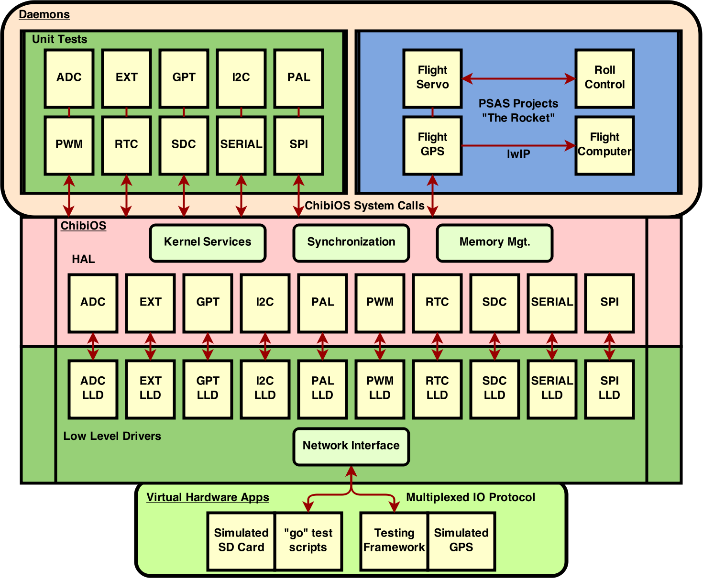

# Requirements

This simulator has only been tested on relatively recent versions of linux.

# Installation

1. Clone the repo.

  ```bash
  git clone https://github.com/PSAScapstone2014/stm32.git
  ```

1. Pull the ChibiOS submodule.

  ```bash
  cd stm32
  git submodule update --init
  

1. Unpack the lwIP package. (Required but unused.)

  ```bash
  cd ChibiOS/ext
  unzip unzip lwip-*_patched.zip
  ```

1. Test it.

  ```bash
  cd ../testhal/Posix/PAL
  make clean
  make
  ./go
  ```

If you see the following output, congratulations! It works!

```
ChibiOS/RT simulator (Linux)

simio connected to 127.0.0.1:27000
[SIMIO] CONNECT
[PAL_IO] <- set IOPORT1 latch to 0x01 (was 0x00)
[PAL_IO] <- set IOPORT1 latch to 0x03 (was 0x01)
[PAL_IO] <- set IOPORT1 latch to 0x07 (was 0x03)
[PAL_IO] <- set IOPORT1 latch to 0x0f (was 0x07)
[PAL_IO] <- set IOPORT1 latch to 0x1f (was 0x0f)
```

# Components

## Overview



The flow chart shows a high level overview of how the various pieces fit together. [[Edit it]](https://drive.google.com/file/d/0B4Dw4LWagHndOXBFWnk4Mjg4cUE/edit?usp=sharing) (You must install draw.io as a google application.)

## Daemons

Starting at the top of the flow chart, we have the daemon processes. The daemons are executable programs representing simulated ChibiOS instances. As ChibiOS is meant to be running as the operating system on embedded hardware, the daemons will almost always run until manually killed by the user. Daemons are divided into two groups: the unit tests and PSAS projects.

Unit tests were developed by the capstone team to test low level drivers. Each behaves differently according to how the developer wanted to run their tests. More detail on these tests will be given later in this document.

The PSAS projects were developed by the PSAS team to run on the rocket. They are generally beyond the scope of this document.

## ChibiOS

Each of the unit tests and most of the PSAS projects make use of the services provided by [ChibiOS](http://www.chibios.org). They usually involve calls to initialize one or more hardware abstraction layer drivers and then, in the case of the unit tests, invoke the needed API calls to test the driver's interface.

## Low Level Drivers (LLDs)

The capstone team developed a total of 10 LLDs during their project. For use in the simulator, the LLDs will either invoke linux system calls or use the network interface API (called simio) to implement features such as fetching the current system time, handling virtual hardware interrupts, or reading and writing data from virtual hardware applications.

## Virtual Hardware Applications (VHAs)

A VHA should be written to interact with the LLDs in some way. The capstone team created a testing framework (documented elsewhere) along with a series of "go" scripts to enable unit testing. Each of the go scripts located under ChibiOS/testhal/Posix provides an example of what a VHA needs to do in order to interact with a running ChibiOS daemon via the LLDs.

Any particular go script will launch and begin listening on TCP port 27000 for incoming connections from the simio network interface. Once the ChibiOS daemon has been started and the LLD has been asked to read or write data, the daemon will connect to the VHA. At this point it is possible to read and/or write data to any of the halconf.h enabled drivers as long as that driver has been registered in [ChibiOS/os/hal/platforms/Posix/simio.h](https://github.com/PSAScapstone2014/ChibiOS-RT/blob/stable_2.6.x/os/hal/platforms/Posix/simio.h).

A more complex VHA will generally involve some sort of hardware emulation or data forwarding service. An example of this can be found in the SDC go script; it emulates a SD Card using an auto-expanding memory buffer.

## SimIO

### Overview

The simio network layer is responsible for reading data into a LLD and writing data to a VHA. It's function interface is documented in [ChibiOS/os/hal/platforms/Posix/simio.h](https://github.com/PSAScapstone2014/ChibiOS-RT/blob/stable_2.6.x/os/hal/platforms/Posix/simio.h).

The functional interface contains:

 * a call to allow a daemon to select the host and/or port in which to connect,
 * two calls to read data from a VHA (with and without a timeout),
 * two calls to write data to a VHA (raw data and formatted data),
 * and a rarely used call to disconnect an active VHA connection.

Upon calling one of the read or write API functions, the interface will attempt to connect to the configured host. By default, this is localhost:27000. If no connection can be made, an error is written to standard error.

### Protocol

Simio uses a fairly simple protocol for communications.

```
LLD_IO <tab> <hexadecimal encoded data> <newline>
```

LLD_IO is the name of the driver identifier as seen in simio.h. The hexadecimal encoded data represents each byte with two hexadecimal characters. For example, to send the string "Hello, world!" to the first serial driver, the message would be

```
SD1_IO  48656c6c6f2c20776f726c6421
```

The serial driver unit test will decode and re-encode the message back to the VHA. More detail on the serial driver is provided later in this document.

### Usage of SimIO in LLDs

LLD developers are able to make use of the simio API after first registering their LLD within the simio source files.

1. Edit [ChibiOS/os/hal/platforms/Posix/simio.h](https://github.com/PSAScapstone2014/ChibiOS-RT/blob/stable_2.6.x/os/hal/platforms/Posix/simio.h) to include a unique identifier in the `hid_t enum`.

1. Edit [ChibiOS/os/hal/platforms/Posix/simio.c](https://github.com/PSAScapstone2014/ChibiOS-RT/blob/stable_2.6.x/os/hal/platforms/Posix/simio.c) to include the same identifier in both the `hid2str` and `str2hid` functions.

This identifier must be passed as the first argument to the IO functions of the simio API.

## LLD Detail

### ADC
Driver Identifier: **ADC_IO**

The Analog to Digital Converter driver is use to convert analog data to digital data. The driver is implement both ways one to convert analog buffer data to digital output. Another is to output the digital output buffer. There's three conversion modes one shot, linear, and circular. One shot and linear conversion modes are about same where it stop at the end of the buffer. Circular, there's a thread of which it will go over the buffer over and over until it's interrupted. 


### EXT

Driver Identifier: **EXT_IO**

The EXTernal device driver is used to issue callbacks when a specific hardware event like a button push is registered. Callback functions may be registered on different channels by the ChibiOS daemon developer. A VHA developer will send a binary number representing the channel number to the EXT driver identifier. At this point the callback function will be triggered.

The go script for the EXT unit test will emulate a button push on channel 0 every second. The expected response will be from the PAL driver indicating that a virtual LED has been toggled.

### GPT

Driver Identifier: **GPT**

The General Purpose Timer is used to set up timers for ChibiOS. It can create timers, start them, set them to run for specified amount of time, do polled delays and stop when done. 

### I2C

Driver Identifer: **I2C**

The Inter-Integrated Circuit driver is used to read and write the I^2C bus. Similar to SPI, however it timeouts, when recieving and transmitting data. 


### PAL

Driver Identifier: **PAL_IO**

The Pin Abstraction Layer driver is used to interface with various IO ports on real hardware. In the simulator, we simply output the state of an IO port and its value. We usually interpret this as an LED being toggled on or off.

The go script for the PAL unit test simply prints out the status of IO ports as the unit test runs. No input is sent to the LLD.

### PWM

Driver Identifier: **PWM**

The Pulse Width Modulation driver is used regulate power to a device example would control the speed of an motor. In the simulator, it displays the frequency and the period. 
### RTC

Driver Identifier: **None**

The Real Time Clock driver implements time and alarm related functions. The driver will provide system time and signal a function callback when an alarm has been set. No simio interface for this driver is needed.

The go script for the RTC unit test outputs PAL pin changes as alarms are set and callbacks are invoked.

### SDC

Driver Identifier: **SDC_IO**

The SD Card driver is responsible for reading and writing to SD cards. In our implementation, the LLD forwards read and write requests over the simio network channel. It is left up to the VHA developer to implement storage facilities.

The SDC LLD uses its own protocol-within-a-protocol for reads and writes. When a read is requested the following messages is sent.

```
cmd read startblk XXXXXXXX nblks YYYYYYYY
```

The *startblk* is indicated by a 32 bit hexadecimal address. *nblks* is a 32 bit hexadecimal count of blocks to read. A block is defined by the MMCSD_BLOCK_SIZE macro and is currently set to 512 bytes. The VHA should then write *nblks* blocks back to the driver starting with block *startblk*.

When the driver needs to do a write, two message are sent. The first message is of the following form.

```
cmd write startblk XXXXXXXX nblks YYYYYYYY
```

*startblk* and *nblks* have identical meaning to the driver's read counterpart. The second message will contain the data to be written to storage.

The go script for the SDC unit test implements this protocol using a in-memory auto-expanding storage device. The unit test runs a badblocks-style read-write test on the virtual storage device. At the end of the test, the go script writes the memory contents to disk and uses hexdump to display its contents.

### SERIAL

Driver Identifiers: **SD1_IO**, **SD2_IO**

The serial driver emulates a serial cable connection. The unit test reads in a buffer and echos it back to the sender. The unit test go script will take input from stdin, send it to the LLD, and display the echo'd response.

### SPI

Driver Identifier: **SPI_IO**

The Serial Peripheral Interface driver is responsible for reading and writing to the SPI bus. It has several modes of operation to select differing slave devices, reading, writing, and exchanging data.

SPI uses a protocol to indicate which operation is being performed. The protocol consists of an operation message followed by 0 or more data messages. The unit test go script for SPI has an example of usage.

#### Operations

##### select *N* / unselect *N*

The select and unselect operations are followed by a number *N* to indicate which virtual slave should be selected or unselected. No additional data message is provided.

##### exchange

The exchange message indicates that the LLD will write some data to the VHA and then immediately wait for a response message from the VHA.

##### polled_exchange

Identical to exchange.

##### send / receive

The send and receive operations indicate that data is to be read by the LLD or written to the LLD, respectively, by the VHA.

##### ignore *N*

Instructs the VHA that the next *N* words should be ignored. The VHA should not send data to the LLD until it would have otherwise sent *N* words.

# PSAS Project Integration

In order to compile and run the PSAS projects in simulator mode, each driver that the project uses must have an implemented simulator LLD and some changes to the project must be made.

1. The project must be compiled with SIMULATOR defined.
  ```bash
  make SIMULATOR=y
  ```

1. The project makefile must correctly reference the simulator code.

1. Blocking lwIP IO functions must be replaced with preemptable versions.

1. Optionally, sim_getopt() may be called to configure the host and/or port of simio connections.

### Makefile Changes

1. Each makefile must reference only the linux gcc and its compatible command line arguments.

1. Simulator `.mk` files must be referenced
  * include $(CHIBIOS)/os/hal/platforms/Posix/platform.mk
  * include $(CHIBIOS)/os/ports/GCC/SIMSTM32/port.mk
  * inlcude $(CHIBIOS)/os/ports/GCC/SIMSTM32/rules.mk

1. IWDG must be disabled.

1. CH_DBG_ENABLE_STACK_CHECK is not supported.

### Source Files

Project developers can make simulator-only code changes by checking for the SIMULATOR macro. For example:

```c
#ifdef SIMULATOR
# define SDX SD1
#else
# define SDX SD6
#endif

sdStart(&SDX, NULL);
```

### lwIP

The PSAS team makes use of [lwIP](http://savannah.nongnu.org/projects/lwip) in some of their projects. The simulator will disable all lwIP functions and provide its own socket API calls in their place.

It is not advisable to use linux system calls that may block within the simulator. A blocking system call will prevent the ChibiOS scheduler from being able to preempt a running thread and the simulator will freeze until the blocking call returns. It is for this reason that the simio network layer provides its own versions of potentially blocking socket calls in [ChibiOS/os/hal/platforms/Posix/sim_preempt.h](https://github.com/PSAScapstone2014/ChibiOS-RT/blob/stable_2.6.x/os/hal/platforms/Posix/sim_preempt.h).

Usage of these functions in PSAS projects is enabled in three steps.

1. The project must `#include "sim_preempt.h"`.

1. All potentially blocking instances of accept(), select(), poll(), and read() must be replaced with ACCEPT(), SELECT(), POLL(), AND READ().

1. These macros must be enabled by defining the SIMULATOR macro.

When the SIMULATOR macro is defined, SIM_PREEMPT_REPLACE_FUNCTIONS is automatically defined and the preemptable functions are enabled. When SIMULATOR is not used the lwIP versions will be used.

### Notes

* There are examples of projects that have been ported to run in simulation mode in the [capstone fork](https://github.com/PSAScapstone2014/stm32) of the PSAS stm32 repository. They are: flight-gps, test-rci, and f407disc_sleep. Each of these projects has a "go" script to test their functionality.

* GCC versions prior to 4.8 do not have __builtin_bswap16(). It is enabled in common/net/net_addrs.c.

* Hardcoded 10-net addresses were replaced with 127-net (localhost) addresses in common/net/net_addrs.c.

* Bugs were corrected in common/net/rci.c:

  * `struct fd_set` is not proper usage on linux.

  * int socket = socket() redefines a function call.

  * 0 isn't checked for as a valid return response from read().

* utils_sockets.c was altered to disable lwipThreadStart.

* [ChibiOS/os/ports/GCC/SIMSTM32/stm32.h](https://github.com/PSAScapstone2014/ChibiOS-RT/blob/stable_2.6.x/os/ports/GCC/SIMSTM32/stm32.h) has some dummy constants that don't really belong there.

# Upstream Merge

As the core developer (gdisirio at gmail.com) will be on vacation until the end of the capstone project, [ChibiOS/mkpatch.sh](https://github.com/PSAScapstone2014/ChibiOS-RT/blob/stable_2.6.x/mkpatch.sh) exists as a way to enable a easy upstream merge of the simulator code into the SVN github repository.

The script first merge in any upstream changes from the github mirror of the SVN repository and then create a pair of patches for examination and for submittal as a patch.

Usage

1. Ensure your upstream is set correctly.

  ```
  git remote -v
  ```
  ```
  git remote add upstream git@github.com:ChibiOS/ChibiOS-RT.git
  ```

1. Run the script.

  ```
  $ ./mkpatch.sh
  Merge git@github.com:ChibiOS/ChibiOS-RT.git into branch stable_2.6.x? y
  Merging Upstream
  remote: Counting objects: 2082, done.
  remote: Compressing objects: 100% (1048/1048), done.
  remote: Total 2082 (delta 1144), reused 1625 (delta 960)
  Receiving objects: 100% (2082/2082), 1003.40 KiB | 954.00 KiB/s, done.
  Resolving deltas: 100% (1144/1144), done.
  From github.com:ChibiOS/ChibiOS-RT
   * [new branch]      chibistudio_trunk -> upstream/chibistudio_trunk
   * [new branch]      kernel_3_alt_vt_dev -> upstream/kernel_3_alt_vt_dev
   * [new branch]      kernel_3_dev -> upstream/kernel_3_dev
   * [new branch]      master     -> upstream/master
   * [new branch]      stable_1.0.x -> upstream/stable_1.0.x
   * [new branch]      stable_1.2.x -> upstream/stable_1.2.x
   * [new branch]      stable_1.4.x -> upstream/stable_1.4.x
   * [new branch]      stable_2.0.x -> upstream/stable_2.0.x
   * [new branch]      stable_2.2.x -> upstream/stable_2.2.x
   * [new branch]      stable_2.4.x -> upstream/stable_2.4.x
   * [new branch]      stable_2.6.x -> upstream/stable_2.6.x
   * [new branch]      utils_dev  -> upstream/utils_dev
  Already up-to-date.

  Diffed Files -- Excluding Added
  M       boards/simulator/board.c
  M       boards/simulator/board.h
  M       demos/Posix-GCC/Makefile
  M       demos/Posix-GCC/halconf.h
  M       demos/Win32-MinGW/Makefile
  M       os/hal/include/serial.h
  M       os/hal/platforms/Posix/hal_lld.c
  M       os/hal/platforms/Posix/hal_lld.h
  M       os/hal/platforms/Posix/pal_lld.c
  M       os/hal/platforms/Posix/pal_lld.h
  M       os/hal/platforms/Posix/platform.mk
  M       os/hal/platforms/Posix/serial_lld.c
  M       os/hal/platforms/Posix/serial_lld.h
  M       os/various/lwip_bindings/arch/cc.h
  M       test/test.c

  Complete Patch: psas_capstone_2014-complete.patch
  Modification-Only Patch: psas_capstone_2014-modified.patch
  ```

The top half of the output is the result of the upstream merge into the local branch. The bottom half lists any changed files that may need close inspection before the upstream merge is allowed.

Two patch files are produced.

1. The complete patch file details all of our work and weighs in at over 18 thousand lines of unified diff code.

1. The modified patch file which is a ~600 line unified diff consisting of only changes to preexisting ChibiOS source.

It is intended that the patch containing only modifications will be given close examination before patch acceptance. The other differences are newly created files and shouldn't need close inspection.

The complete patch can be applied to a clean ChibiOS repository using the patch utility. To apply the patch, run, from the ChibiOS root directory:

```bash
patch -p0 < path/to/psas_capstone_2014-complete.patch
```
